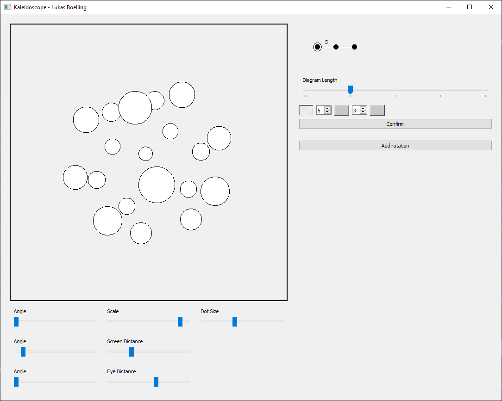

# Polytope Visualizer
A program that renders 3D polytopes from their [Coxeter diagram](https://en.wikipedia.org/wiki/Coxeter%E2%80%93Dynkin_diagram) representation.

Given a set of mirrors and a point, the point can be repeatedly reflected between the mirrors to generate a polytope,
provided that the mirrors are arranged properly.

With one arrangement, a dodecahedron is created:

## Higher Dimensions

Longer Coxeter diagrams correspond to higher dimensional polytopes. Here's a tesseract:

